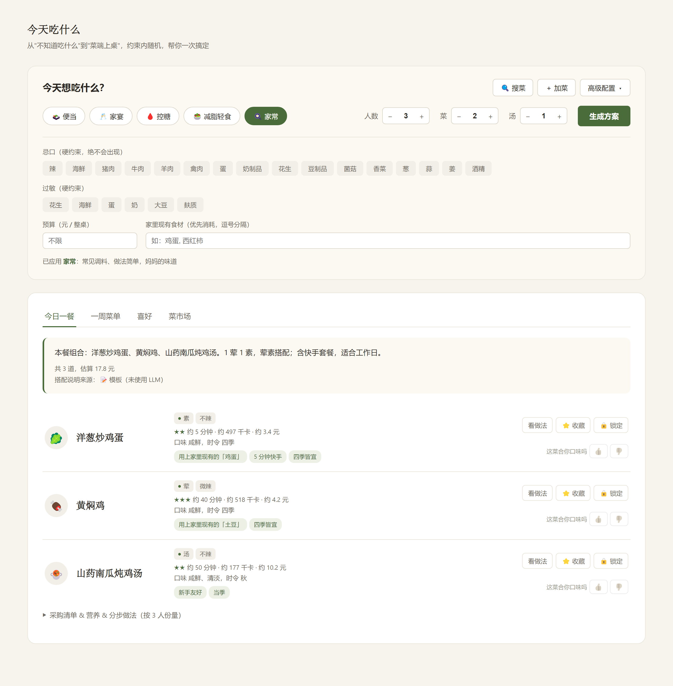
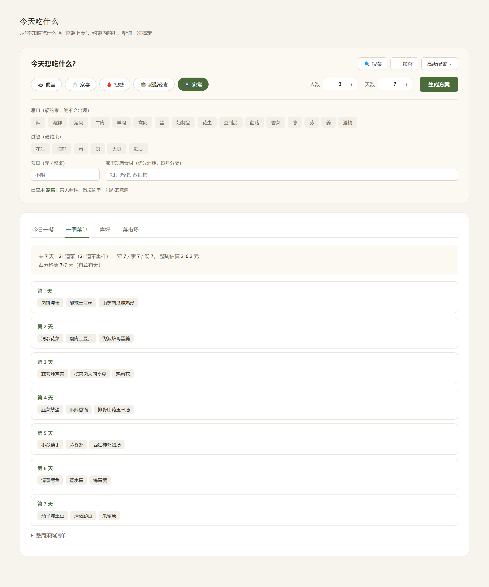
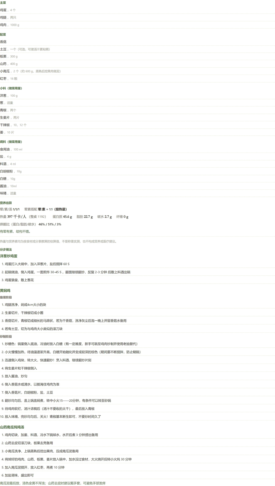
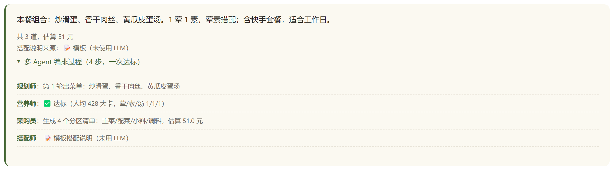
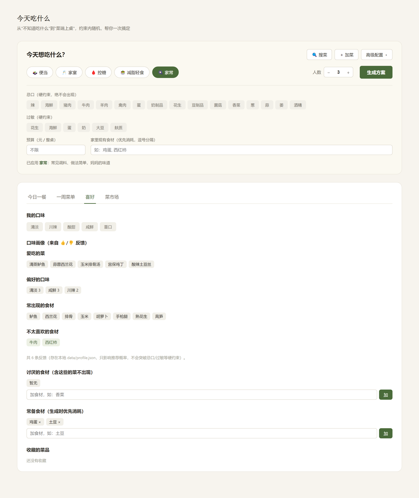
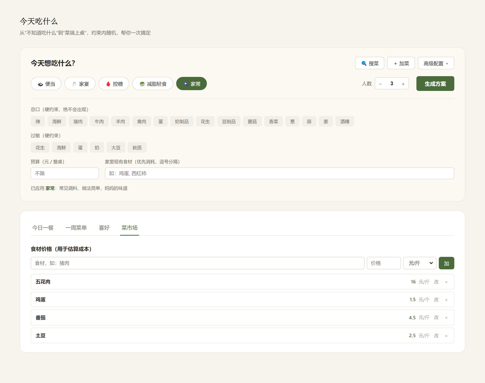
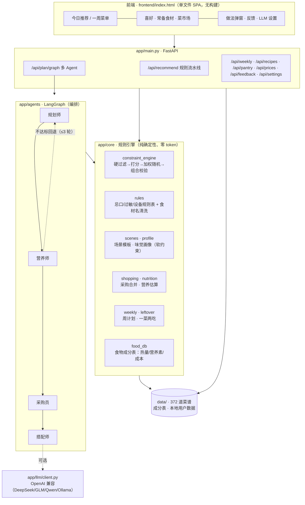
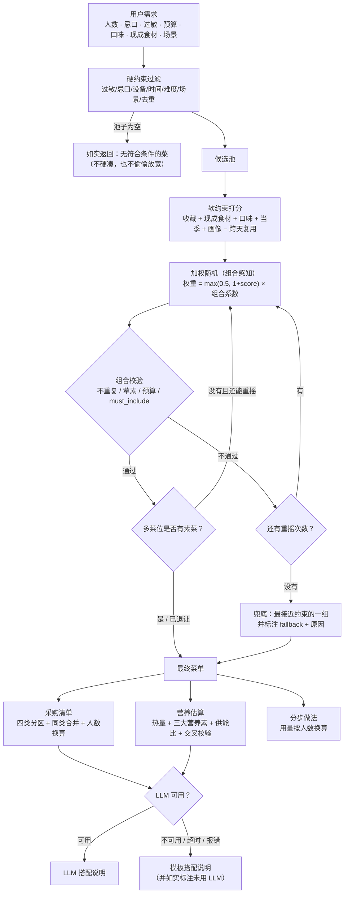
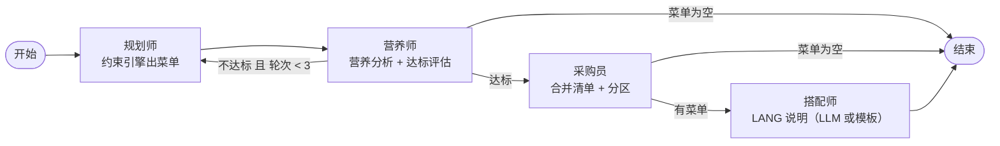

# 🍳 今天吃什么 · 家庭餐桌助手

> 输入几个条件，得到一份完整方案：**吃什么 → 买什么 → 怎么做 → 营养如何**。

一个本地优先（local-first）的家庭菜单生成器。核心不是"随机推菜"，也不是"让大模型随便编"，
而是在**用户约束范围内做加权随机**——规则保证不出错，随机保证有惊喜，LLM 只负责把理由说人话。

## 📸 示例

| 今日一餐（推荐理由 / 难度 / 用时 / 热量 / 成本 / 一键反馈） | 一周菜单（不重样 + 整周采购） |
|---|---|
|  |  |

| 采购清单 & 营养 & 分步做法 | 多 Agent 编排过程（LangGraph） |
|---|---|
|  |  |

| 喜好 / 口味画像 | 菜市场（自定义食材价格） |
|---|---|
|  |  |

## ✨ 核心功能

- **约束内随机推荐**：忌口 / 过敏 / 设备 / 预算 / 时间 / 难度做硬约束过滤，口味 / 收藏 / 当季 / 食材复用做软约束打分，加权随机 + 组合校验
- **硬约束绝不放水**：过敏与忌口词表按"宁可误伤、不可漏放"设计；上菜前逐条复核（见测试 `test_hard_constraints_never_violated`）
- **一桌菜会自己配**：多菜位自动避免"两道菜同一个主料"，并保证有荤有素
- **完整方案**：菜单 → 合并采购清单（主菜/配菜/小料/调料四类，调料只列做菜用量）→ 分步做法（用量按人数换算）
- **周计划**：N 天不重样（默认最紧的硬排除），跨天均衡荤素，自动合并整周采购清单
- **营养估算**：热量 + 蛋白质/脂肪/碳水/纤维 + 供能比 + 荤素比，数据对不上时如实说明而不是编数
- **家庭味觉画像**：菜品卡上 👍/👎，本地沉淀口味/食材偏好，反哺后续推荐的软约束
- **多 Agent 编排（LangGraph）**：规划师 → 营养师 → 采购员 → 搭配师，营养不达标自动回退重规划（最多 3 轮，有硬上限）
- **一菜两吃**：给剩菜找二次加工方案（复用主料 + 加工方向）
- **菜市场**：自定义食材价格，接进成本估算与预算校验
- **搜菜 / 加菜**：搜全量菜谱（含被家常化过滤掉的牛羊肉/名贵菜），添加自己的菜
- **场景模板**：便当 / 家宴 / 控糖 / 减脂轻食 / 家常，一键预设约束
- **BYOK + 无 Key 可用**：配了 LLM 则叠加智能搭配说明与家常简化做法；不配也能完整使用
- **纯本地**：数据都存在本机 `data/`，不上传任何用户数据

## 🧠 核心设计：约束内随机

> 不是完全随机（那叫抽签），也不是完全精准（那叫查表）——
> 而是在用户约束范围内给出"**惊喜但不离谱**"的组合。

```
第一步 硬约束过滤  忌口 / 过敏 / 设备 / 时间 / 难度 / 预算 / 场景   —— 不满足直接淘汰，永不妥协
第二步 软约束打分  收藏 / 现成食材 / 口味 / 当季 / 味觉画像         —— 只影响概率，不做过滤
第三步 加权随机    分数→权重（有保底 0.5），且组合感知               —— 高分概率高，低分非零
第四步 组合校验    不重复 / 荤素搭配 / 预算 / must_include           —— 不过就重摇（上限 50 次）
第五步 软偏好重摇  多菜位尽量配一道素菜，摇不到就退让并如实标注
```

关键取舍：

| 做法 | 为什么不用 |
|---|---|
| `max(score)` 直接取最高分 | 推荐结果固化，失去"惊喜"，用户几天就腻 |
| 完全随机 | 可能端出一桌不搭的菜，浪费食材，违背"家庭餐桌"定位 |
| 让 LLM 决定菜单 | 无法保证过敏/预算/设备等硬约束，且每次结果不可复现、有 token 成本 |

## 🏗️ 系统架构



**职责边界（重要）**：规则负责确定性，LLM 负责表达。

| 由代码负责（确定性、可复现） | 由 LLM 负责（可选、可失败） |
|---|---|
| 过敏 / 忌口 / 设备 / 预算 / 时间过滤 | 搭配说明的自然语言表达 |
| 热量、营养素的估算与合计 | 家常简化版做法的改写 |
| 采购数量、成本、用量换算 | （失败即回落到模板，不影响主流程） |
| 菜单组合与荤素搭配 | |

## 🔀 推荐流程



## 🤖 LangGraph 多 Agent 编排



- **营养师回退**：把"缺蔬菜 / 热量偏高 / 蛋白质偏少"作为软约束注入下一轮打分（`retry_hint`），而不是盲目重摇
- **硬上限** `MAX_ATTEMPTS = 3`：避免"不达标→重规划"无限循环 + 无限烧 token
- **菜单为空直接结束**：没有候选菜时重规划 3 轮毫无意义，直接返回原因
- **无 LLM 可跑通**：四个节点全部有规则实现，`llm_used` 字段会如实反映这一轮到底用没用 LLM
- 返回 `agent_trace`（每步说明）与 `replans`（回退轮次），前端可展开查看

## 🛠️ 技术栈

| 层 | 选型 | 说明 |
|---|---|---|
| 后端 | Python 3.11+ / FastAPI / Pydantic | 类型校验 + 自动 OpenAPI |
| 编排 | LangGraph | `StateGraph` + 条件路由实现可回退工作流 |
| 大模型 | 任意 OpenAI 兼容接口（httpx 直连） | 不绑定厂商，BYOK；无 Key 时全功能可用（除 LLM 文案） |
| 前端 | 单文件 HTML + 原生 JS（无框架、无构建） | 双击即用，PyInstaller 打包友好 |
| 数据 | 内置 JSON（菜谱 / 食物成分表） + 本地用户数据 | 无数据库，local-first |
| 部署 | Docker / 本地 Python / Windows EXE | 三种方式互不冲突 |

## 📦 项目结构

```
app/
├── main.py                    FastAPI 路由（参数校验 / 统一错误 / 日志）
├── config.py                  BYOK 配置（.env + 运行时设置，Key 脱敏输出）
├── paths.py                   路径统一（只读资源 vs 可写数据，支持打包）
├── core/
│   ├── constraint_engine.py   约束内随机引擎（产品灵魂）
│   ├── rules.py               忌口/过敏/设备/口味规则表 + 食材名清洗 + 家常化
│   ├── scenes.py              场景模板（便当/家宴/控糖/减脂/家常）
│   ├── profile.py             家庭味觉画像（👍/👎 沉淀，软约束）
│   ├── weekly.py              周计划生成器（跨天去重 + 均衡）
│   ├── leftover.py            一菜两吃（剩菜二次加工）
│   ├── shopping.py            采购清单合并与分区
│   ├── nutrition.py           营养估算（含数据可信度交叉校验）
│   └── food_db.py             食物成分表查询 + 热量/营养素/成本估算
├── agents/
│   ├── planner.py             规则流水线 + 推荐理由生成
│   └── orchestrator.py        多 Agent 编排（LangGraph）
└── llm/client.py              OpenAI 兼容客户端（超时/错误处理，不泄露 Key）
data/
├── recipes.json               372 道结构化菜谱（难度/耗时/原料/用量/分步做法）
├── food_composition.json      中国食物成分表（1654 条）
└── （本地用户数据：profile / pantry / prices / settings / user_recipes）
frontend/index.html            单文件前端
tests/                         pytest 测试（208 个用例）
scripts/                       数据管道：下载 → 解析 → 清洗 → 补全 → 重算热量
```

## 🚀 快速开始

### 本地运行

```bash
pip install -r requirements.txt
python run.py            # 起服务并自动打开浏览器 http://127.0.0.1:8000
# 或：uvicorn app.main:app --reload
```

Windows 用户也可以直接双击 `start.bat`（自动装依赖 + 启动）。

### Docker

```bash
docker compose up -d     # 不需要 .env，没有也能起来
# 打开 http://localhost:8000
```

数据（菜谱、画像、价格、设置）挂在 `./data`，容器重建不丢。

### Windows EXE（无需装 Python）

```bash
build.bat                # 生成 dist\今天吃什么.exe
```

双击即可使用。用户数据存在 exe 旁边的 `data\` 目录。

## 🔑 接入 LLM（可选）

**不接 LLM 也能完整使用**：推荐、采购、营养、周计划全靠规则引擎，搭配说明用模板。
接上之后，"搭配说明"和"家常简化版做法"会换成更自然的表达。

配置位置：打开页面 → **高级配置** → **LLM 设置** → 填 Base URL / API Key / 模型 → 保存 → 测试连接。

以 DeepSeek 为例：`https://api.deepseek.com/v1` + `sk-...` + `deepseek-chat`。
本地 Ollama 无需 Key（如 `http://127.0.0.1:11434/v1` + `qwen2.5`）。

也可以直接编辑 `.env`：

```bash
cp .env.example .env
```

**安全约定**：API Key 只存在服务端（`.env` 或 `data/settings.json`，两者都在 `.gitignore` 里）；
`GET /api/settings` 只返回脱敏串（如 `sk-****c204`），明文不出服务端；日志里只记 Key 长度，不记内容。

### LLM 容错

| 情况 | 行为 |
|---|---|
| 没有 Key | 搭配说明用模板，`llm_used: false`，其余功能完全正常 |
| Key 无效 / 401 | 记录日志 + 回落模板，**不会**让接口 500 |
| 请求超时（默认 30s） | 回落模板，接口照常返回 |
| 返回空内容 / 非 JSON / 缺字段 | 回落模板 |
| 报错信息 | 统一包装成 `LLMError`，消息里不含 API Key |

## 📡 API

| 方法 | 路径 | 说明 |
|---|---|---|
| GET | `/api/health` | 健康检查（含菜谱库加载状态） |
| GET | `/api/meta` | 前端选项：忌口/过敏/设备/口味/场景 + 菜谱数 |
| POST | `/api/recommend` | 单餐推荐（规则流水线） |
| POST | `/api/plan/graph` | 单餐推荐（LangGraph 多 Agent，带 `agent_trace`） |
| POST | `/api/weekly` | 周计划（N 天不重样 + 整周采购） |
| POST | `/api/leftover` | 一菜两吃（剩菜二次加工） |
| POST | `/api/simplify` | 家常简化版做法（需 LLM） |
| GET/POST | `/api/feedback` · `/api/profile` | 口味反馈 / 画像摘要 |
| GET | `/api/recipes/search` · `/api/recipes/{id}` · POST `/api/recipes` | 搜菜 / 查菜 / 加菜 |
| GET/POST | `/api/pantry` · `/api/prices` | 常备食材 / 食材价格 |
| GET/POST | `/api/settings` · POST `/api/llm/test` · `/api/llm/models` | LLM 配置（Key 脱敏） |

约定：成功返回 `ok: true` + 业务字段；语义错误返回 `ok: false` + `error`（HTTP 200，前端好处理）；
参数越界返回 422；`dishes + soups` 都为 0 返回 400；未预期异常返回 500 + 通用文案（堆栈只进服务端日志）。

## 📖 数据来源

- **菜谱**：[Anduin2017/HowToCook](https://github.com/Anduin2017/HowToCook)（Unlicense，公共领域），
  经 `scripts/parse_recipes.py` 解析、`scripts/clean_recipes.py` 清洗为结构化 JSON
- **营养成分**：[中国食物成分表（第 6 版）](https://github.com/Sanotsu/china-food-composition-data)，
  由 `scripts/download_food_composition.py` 下载，`scripts/recalc_calories.py` 按"主料密度 × 用量"估算热量

> ⚠️ **营养数据是估算，不是实测，也不是医学/营养诊断。**
> 热量与营养素由食材成分表推算（主料密度 × 估算用量 + 烹调油），存在系统性偏差：
> 成分表列的是**生/干重**数值，而菜品实际按熟重计算（米面类会因此偏高）；
> 单盘用量也是经验值。因此营养素与整菜热量会做一次量级交叉校验，
> **对不上的菜不计入合计，并在界面上说明有几道菜没算进去**——而不是硬凑一个数字。

## ✅ 测试

```bash
pip install -r requirements-dev.txt
pytest                      # 212 个用例
```

覆盖重点（都是"曾经会错/必须不能错"的地方）：

| 测试文件 | 覆盖 |
|---|---|
| `test_constraint_engine.py` | 硬约束 600+ 道菜零违反、软约束不过滤只加权、收藏/食材复用不垄断、组合校验、预算与展示同口径、兜底与边界（0 菜位 / 无候选 / max_attempts=0） |
| `test_rules.py` | 忌口词表缺口审计（腊肠→猪肉等）、食材名清洗、设备识别、家常化过滤（小龙虾 vs 龙虾） |
| `test_nutrition.py` | 不编造（不可信时给 `None` 不给 0）、免责声明、供能比自洽、达标评估不空转 |
| `test_shopping_weekly.py` | 分类修正（玉米）、并列食材拆分、采购合并、周计划不重样、跨天均衡、食材合理复用 |
| `test_api.py` | 响应结构、参数校验、Key 不回传明文、同一 seed 可复现、单菜成本合计 = 整桌成本、500 不泄露内部信息 |
| `test_llm_fallback.py` | 无 Key / 401 / 超时 / 非 JSON / 空回复 / 调用失败 → 全部回落模板且如实标注 |
| `test_langgraph.py` | 图结构、回退次数封顶、空菜单不空转、`retry_hint` 真的注入下一轮、无 LLM 可跑通 |

测试会通过 `APP_DATA_DIR` 指向临时目录，**不会碰到你的真实数据**。

## 🔭 未来规划

- [ ] 菜谱图片（当前用 emoji 做视觉标记：不依赖网络、不会加载失败、也没有假图）
- [ ] 营养模型的熟重换算（修正米面类偏高的问题）+ 更多成分表别名
- [ ] 采购清单按超市动线排序、支持导出/分享
- [ ] 家庭成员各自忌口（当前是"全家取并集"）
- [ ] 冰箱库存的保质期与消耗提醒

## 📄 协议

MIT License。菜谱数据来自 HowToCook（Unlicense，公共领域），可自由使用。
